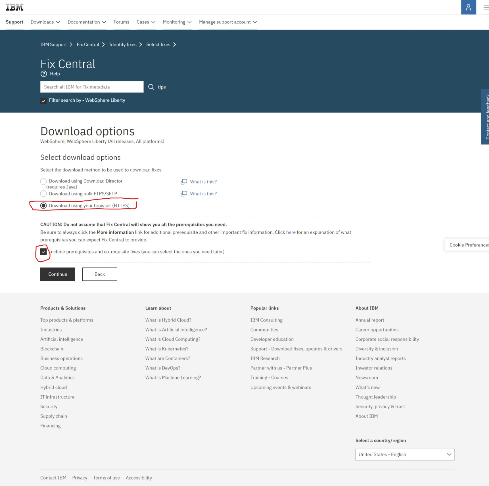
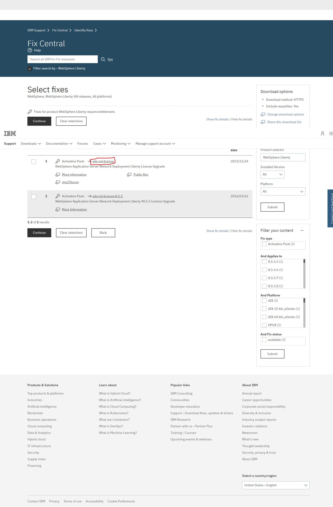
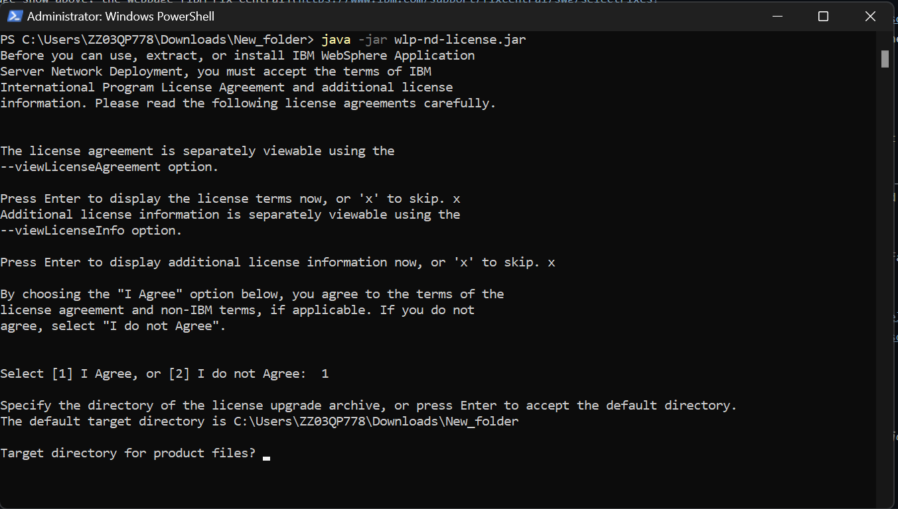

# WebSphere Liberty

## Introduction

In this tutorial, the main objective is to showcase the procedure from Downloading WebSphere liberty to enabling the auto scaling feature in liberty. WebSphere liberty Network Deployment 23.0.0.9 is used in this tutorials as Liberty core and Liberty base doesnt support the auto scaling feature. If any error occur, visit the official [IBM documentation](https://www.ibm.com/docs/en/was-liberty/nd) page to find out more.

Windows will be used as the Operating System, Command Line will be used over IBM Installation Manager and some installation will be using IBMid exclusive portal for downloads (alternative will be written but will not be demonstarate). 

**Ensure you have IBM version of JRE installed **

## Part 1 : Liberty Download & installation

1. As the image show above, the webpage [IBM Fix Central](https://www.ibm.com/support/fixcentral/swg/selectFixes?parent=ibm/WebSphere&product=ibm/WebSphere/WebSphere+Liberty&release=All&platform=All&function=fixId&fixids=wlp-nd-all-23.0.0.9&includeSupersedes=0&source=fc) is the place to download WebSphere Liberty for users with IBMid and as for IBM customer, using IBM passport advantage will be an alternative for dowloading WebSphere Liberty. Click on the word within redbox will direct you to the download page of the liberty.

2. Then, choose the option of download usng HTTP as shown on the image above as it is the most convenient method.

3. After landing on the page shown above, click on all the download files to download all the essential files for WebSphere Liberty to function as it should be.

4. After successfully download of all the files, open your PowerShell for Windows or terminal for MacOS and Linux in administrator mode. Then, type  _java -jar wlp-<edition>-all-<fix_pack>.jar_ to extract and install WebSphere Liberty ND. the <edition> should be nd in wlp-nd-all-23.0.0.9 and the <fix_pack> would be 23.0.0.9 depending on the period you browse through this demo. As of now  _java -jar wlp-nd-all-23.0.0.9.jar_ will be the command line to extract the application.

5. Then press _x_ to skip and 1 to agree to all the terms and condiiton. Enter the file path to extract the application on or press enter for the default file path to he used as shown in the prompt above.

6. Applying ND license will be the next step if all the above are successfully done.  [IBM Fix Central](https://www.ibm.com/support/fixcentral/swg/selectFixes?parent=ibm/WebSphere&product=ibm/WebSphere/WebSphere+Liberty&release=All&platform=All&function=fixId&fixids=wlp-nd-all-23.0.0.9&includeSupersedes=0&source=fc) will direct you to the webpage for WebSphere license download. Click on the link in the red box as shown above to download the file.

7. Download all the file in the red box by clicking on it as shown above.

8. Direct your file path of terminal or PowerShell to the download directory of the license file location. Then, enter the following command _java -jar wlp-nd-license.jar_ to PowerShell or terminal and then click on enter.

9. Click on x to skip and then 1 to agree on the terms and condition. Then, enter the file directory of the location of the extraction of WebSphere Liberty. Successfull will be shown if the license is applied.

## PART 2 : Creation Configuration and Deployment of Server

### Creation of Server

1. By using administrator mode of terminal and PowerShell, direct the directory to your bin file of the WebSphere Liberty such as _<file_path>/wlp/bin_. Enter _./server create <server_name>_ to create a server, for this demo **Controller** will be the name of the server. Succesfull will be shown if the server's created.

2. To check if the server creation, _./server list_ can be used to show the list of server created as shown on the image above.

### Adding Admin center feature to the server

1. Using file explorer, look for a server.xml file in the _<file_path>/wlp/usr/servers/<server_name>/server.xml_.

2. Then double click to open the file. you will be able to see something similar to the image shown above.

3. To anable admin center feature, you will need to add the feature to the feature manager section, admin role and provide username and password. You can refer to the image above to fill in the missing elements contrasting to the server.xml you have now.

4. To access admin center, open your browser, then enter the address https://localhost:9443/adminCenter/login.jsp. (modify the address depending on the host name used and the https port number assigned.)

5. The admin center allows the users to monitor and administering the server more easily.

### Configuring collective collector

1. To create a collective, a few prerequisites are needed to be taken care of. The first one will be to ensure your JAVA_HOME directory was set and directed to the IBM JAVA file location as typical Java doesnt include some of the feature needed for collective to run. Second, setting up the RXA to allows communication between servers and allows a servers to control the other servers in the collective. Registering and modify host information is also something you wanted to try. 

2. Open terminal on MacOS and linux or PowerShell on Windows, direct the path to _<file_path>/wlp/bin_.

3. use the command _./collective create Controller --keystorePassword=controllerKSPassword --createConfigFile=<file_path>/servers/Controller/controller.xml
_ to make the controller server created on the previous as the collective controller.

4. If the creation of collective is successful, your output should be something similar to the image shown above. In the image, there shows a line of code with **include** and that line should be included in the server.xml file of the server used to act as a collective controller.

### Adding member to the collective

1. Create a server if no server is ready to act as the collective member of the collector. In this demo member1 and member2 is created

2. Join member1 to the collective by using the following line _./collective join member1 --host=ibm-pf3f2ctv.my.ibm.com --port=9443 --user=admin --password=adminpwd --keystorePassword=memberKSPassword_. Press y if the terminal prompt to accept some agreement. 

3. After successfully join the collector, copy and paste the output to the server.xml file of the member1 as shown on the image above.

4. Repeat the steps above for member2 but using the line  _./collective join member2 --host=ibm-pf3f2ctv.my.ibm.com --port=9443 --user=admin --password=adminpwd --keystorePassword=memberKSPassword --createConfigFile=C:\Users\ZZ03QP778\wlp\usr/servers/member2/member.xml_. The difference is that the line used by member2 will create a file at the directory specified therefore, the tidiness of the main server.xml will be maintaned.

5. Same as the collective collector, you should see a line with **include** and that line should be copy and paste to the server.xml file of member2.

6. Access to the admin center and you should see both of the member is shown in the admin center as shown on the image above.

### Configuring dynamic routing
_From this step onwards, the tutorials doesnt have an actual picture and steps but just a general walkthrough of some of the typical steps to enable auto scaling between servers in WebSphere Liberty._

[IBM dynamic routing documentation](https://www.ibm.com/docs/en/was-liberty/nd?topic=collectives-setting-up-dynamic-routing-single-liberty-collective)

### Configuring auto scaling
[IBM auto scaling documentation](https://www.ibm.com/docs/en/was-liberty/nd?topic=collectives-setting-up-auto-scaling-liberty)
